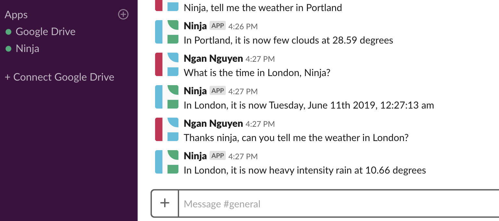

<h3 align="center"> AI SlackBot BoilerPlate</h3>
<h4 align="center"> By Ngan Nguyen </h4>

## Description

_This slackbot allows user to access the time and weather base on a location ._

# 

## Table of Content

- [Features](#Features)
- [Technology](#technology)
- [Installation](#installation)
- [License](#license)

## Features
* AI is created using Wit AI with intent set for time and weather
* Location and Time uses Google's Geocaching API and TimeZone API
* Weather API uses openweatherapi

## Technology
* Superagent
* Express
* NodeJs
* Slack
* Wit AI

## Installation

1. Credentials needed: Slack Bot User Token, Google API Key and Wit.AI API Key.
2. Clone Respository
```
$ git clone git repository link
```
3.Change into the project directory and install npm
```
$ npm install
```
4. Add Slack Token and Wit token in run.js
```
$ node bin/run.js
```
5. Add Google API Key for Time and Location for microservices in service.js
```
$ node bin/run.js
```
In the terminal for the main service you should see the below reponse if services are working correctly.
Main Service:
```
$ $ node bin/run.js
IRIS is listening on 3000 in development.mode
{ ok: true,
  url:
   'wss://cerberus-xxxx.lb.slack-msgs.com/websocket/wPnaWoy9i=g=',
  team:
   { id: 'Tasaf4', name: 'Acme Dev', domain: 'acmedevglobal' },
  self: { id: 'UJsadadfC', name: 'iris' },
  response_metadata:
   { scopes: [ 'identify', 'bot:basic' ],
     acceptedScopes: [ 'rtm:stream', 'client' ] } }
Logged in as iris on team Acme Dev, but not yet connected to a channel
Message sent:  1561502105.000300
From Service Registry, added service for intent weather on [::ffff:127.0.0.1]:59421
From Service Registry, added service for intent time on [::ffff:127.0.0.1]:59423
Updated service for intent weather on [::ffff:127.0.0.1]:59421
Updated service for intent time on [::ffff:127.0.0.1]:59423
From Service Registry, added service for intent weather on [::ffff:127.0.0.1]:59471
Updated service for intent time on [::ffff:127.0.0.1]:59423
```
Weather Intent:
```
IRIS-Weather is listening on 59471 in development mode.
{ result: 'weather at [::ffff:127.0.0.1]:59471' }
```

Time Intent:
```
IRIS-Time is listening on 59423 in development mode.
{ result: 'time at [::ffff:127.0.0.1]:59423' }
{ result: 'time at [::ffff:127.0.0.1]:59423' }
{ result: 'time at [::ffff:127.0.0.1]:59423' }
```

## License
* This project is licensed under the MIT License - see the LICENSE.md file for details
